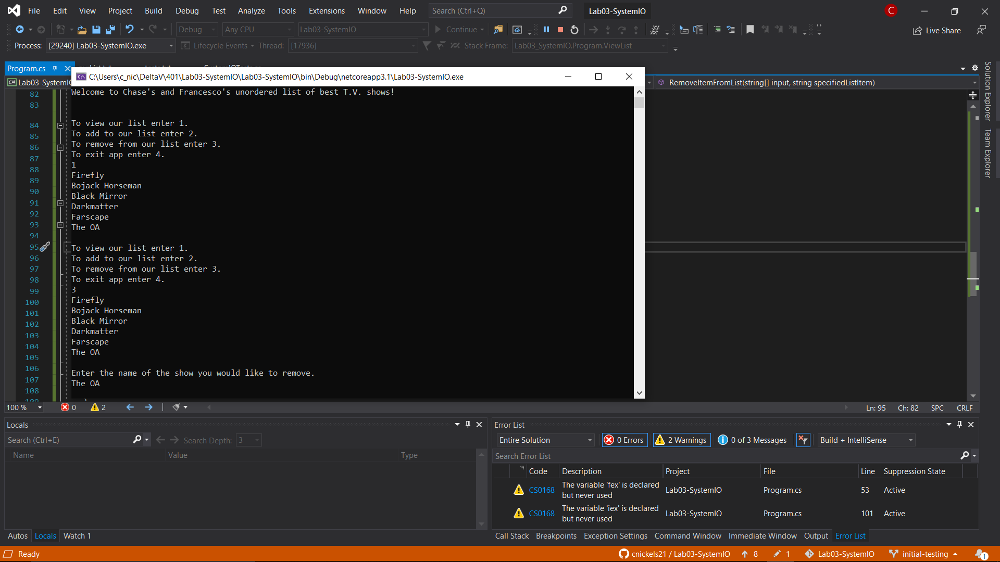
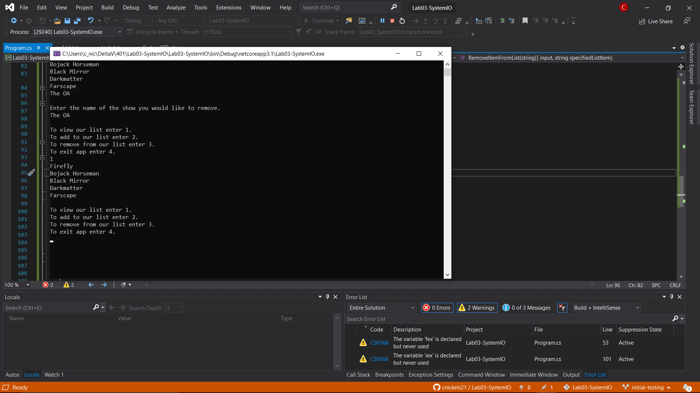
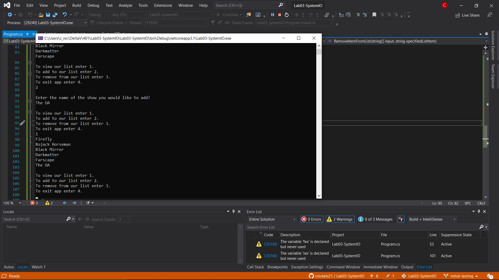

# Lab03-SystemIO

Create a persisting list that the user can add to, remove from, and view.

## Summary

A console app that, given a list of our favorite tv shows, the user is then able to view that list, add items to that list, or remove items from the list.  Using System.IO in the .NET Core framework this app is able to create persistent storage by writing to, appending to, and deleting from a file stored within the directory.

## Using the App

When the app starts it displays a list of our favorite tv shows and then prompts the user to choose an action.  By pressing one they can view the list as it is.  By pressing two they can add their own favorite shows to our list! When they enter three they can remove a show from the list, and if they enter a show that doesn't exist on the list the app tells them that and returns the list as is.  All the while they can still view the updated list accordingly.  Finally, when four is entered the app closes out accordingly.

## Approach

Our approach to designing this app was through TDD, test driven development.  We ran multiple tests for the methods we created to handle all of the different user interactions.  Through pair programming, and a fair bit of outside help we were able to successfully implement our first attempt at creating system persistence.

